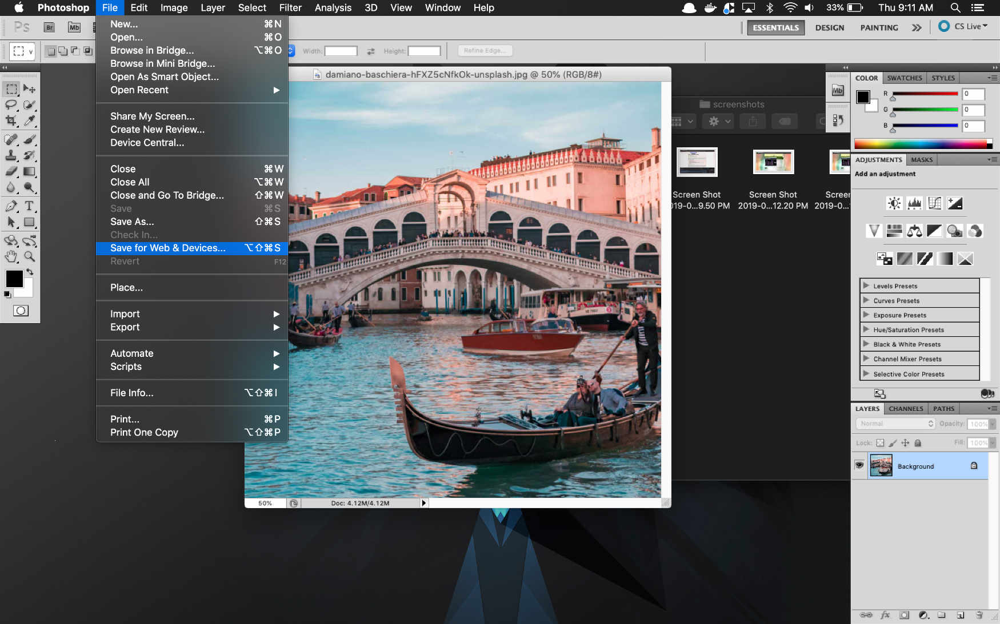
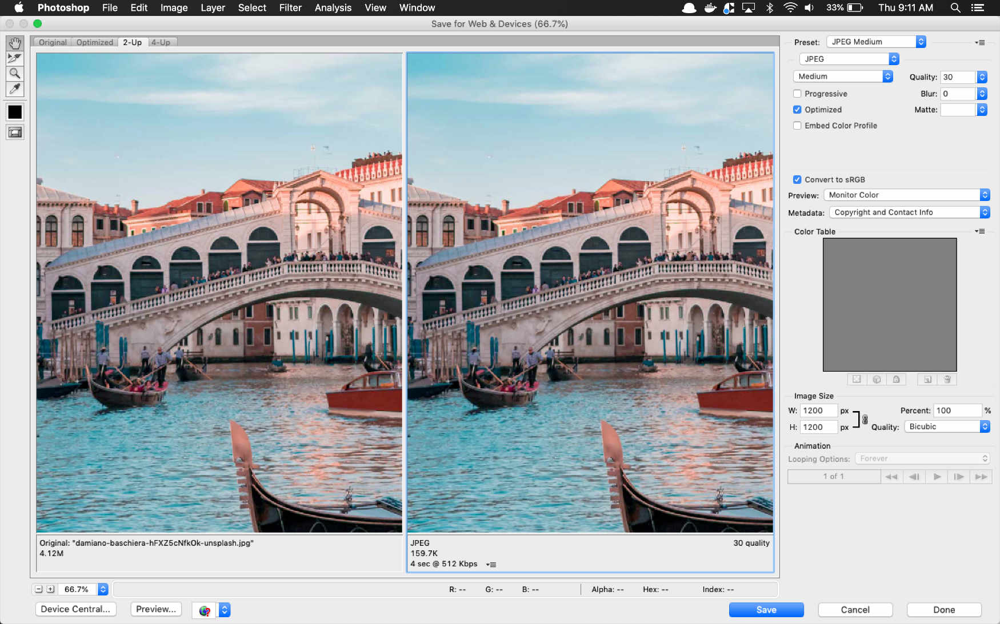
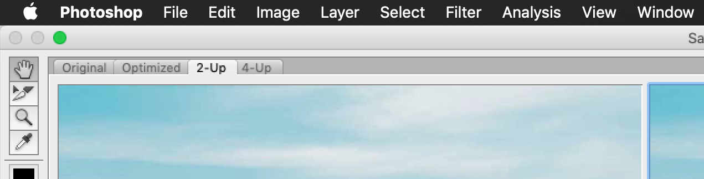
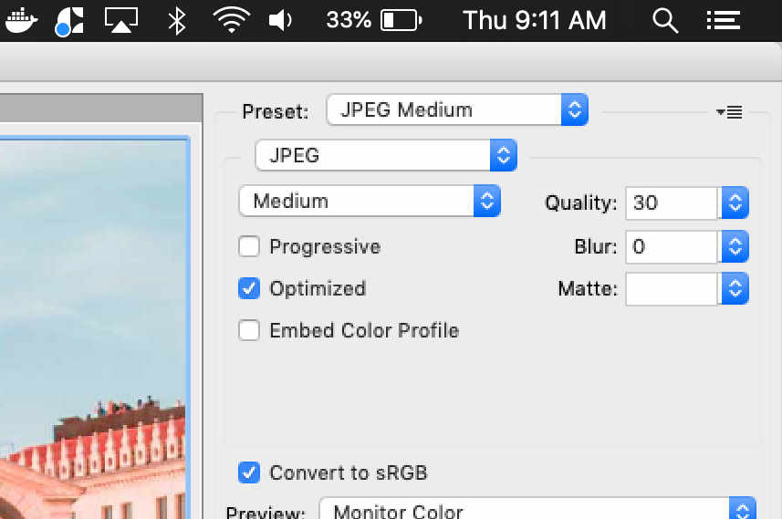
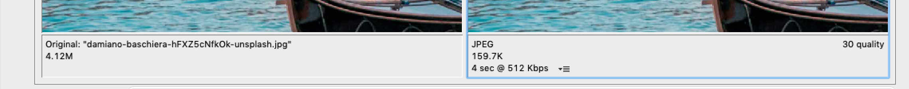
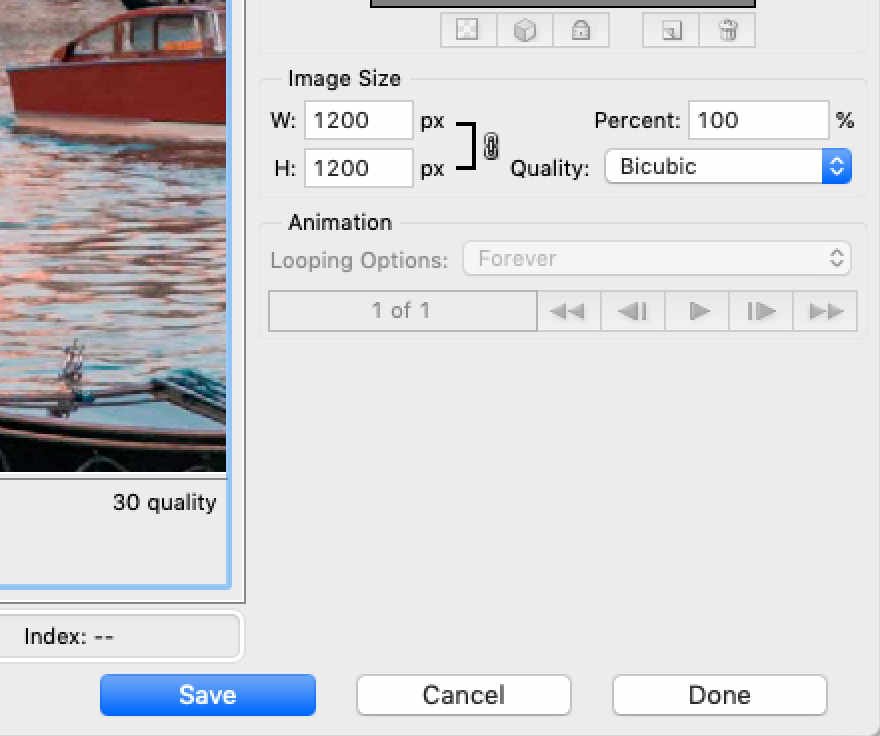

# Image Types

**JPEG / JPG** - is a commonly used method of lossy compression for digital images, particularly for those images produced by digital photography. The degree of compression can be adjusted, allowing a selectable tradeoff between storage size and image quality. JPEG typically achieves 10:1 compression with little perceptible loss in image quality.

**PNG** (ping) - is a raster-graphics file-format that supports lossless data compression. PNG was developed as an improved, non-patented replacement for Graphics Interchange Format (GIF). It can support transparency and the file size is usually larger as it supports more color.

**GIF** - The format supports up to 8 bits per pixel for each image, allowing a single image to reference its own palette of up to 256 different colors chosen from the 24-bit RGB color space. It also supports animations and allows a separate palette of up to 256 colors for each frame. These palette limitations make GIF less suitable for reproducing color photographs and other images with color gradients, but it is well-suited for simpler images such as graphics or logos with solid areas of color.

**SVG** - Scalable Vector Graphics (SVG) is an XML-based markup language for describing two dimensional based  vector graphics. SVG is essentially to graphics what HTML is to text.

SVG is a text-based open Web standard. It is explicitly designed to work with other web standards such as CSS, DOM, and SMIL.

# Image Optimization

Basic tooling for images optimization. Please note screenshots are from Adobe Photoshop CS5.

1. File > Export > Save for Web and Devices Legacy (Photoshop CC+)
File > Save for Web and Devices
(Keyboard Shortcode: Command, Option, Shift, + S)

2. Inside of this next window you'll have several options to compare / optimize your photos.

3. In the top left hand corner you'll see 4 tabs for comparing the images Original, Optimized, 2 up and 4 up. As show 2 up compares your original image on the left and the optimized one on the right. Use this to check for any lossyness / pixelation in the photo itself.

4. There are several presets for the images you want to use - if you're optimizing JPGs, the standard is JPG Medium, Quality should be set between 30 and 45. If the image has too many artifacts you can increase the blur on the image to reduce that. 9 times out of 10 most people can't tell the difference unless the artifacts / pixelation is gigantic.

5. In the bottom left hand corner you can see the original size (as shown 4.12M / 158.7k) compared to the optimized image with how long it would take to download the image. Default is 512kbps, as that's usually the slowest 3G / 2G connection available.

6. Saving

If your outputing for non retina displays or need multiple sizes, you can export them directly in this area. Afterwords hit save and replace your image.

## Photoshop Alternatives

Tired of Adobe?

* [Affinity Tools - Designer, Photo and Publisher](https://affinity.serif.com/en-us/)
* [Dark Table - Lightroom Alternative](http://darktable.org/)
* [GIMP](https://www.gimp.org/)

## Optional Tools

If you want to squeeze out any excess metadata, compress even further.

* [Image Optim - Mac Desktop App, Paid Web App](https://imageoptim.com/mac)
* [Kraken](https://kraken.io/)
* [Tiny PNG](https://tinypng.com/)
* [Image Compressor](https://www.websiteplanet.com/webtools/imagecompressor/)
