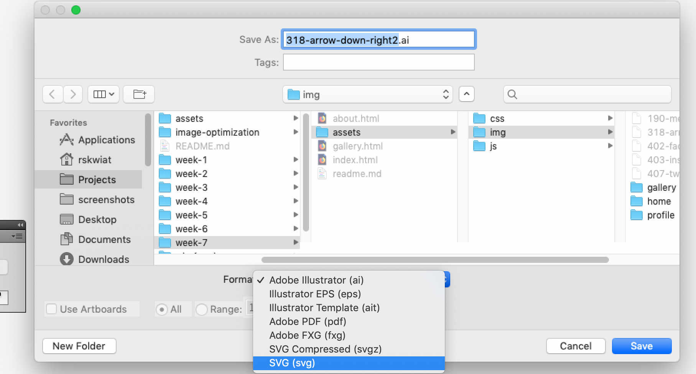
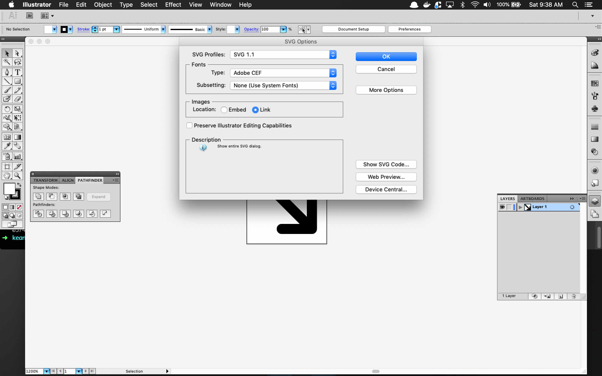
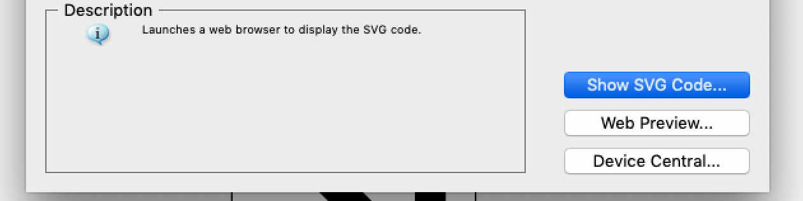
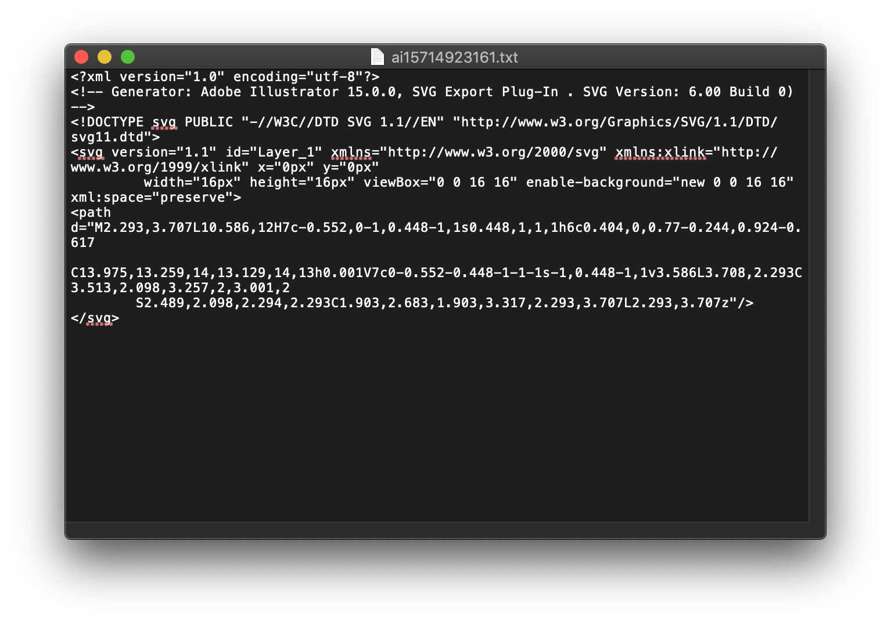
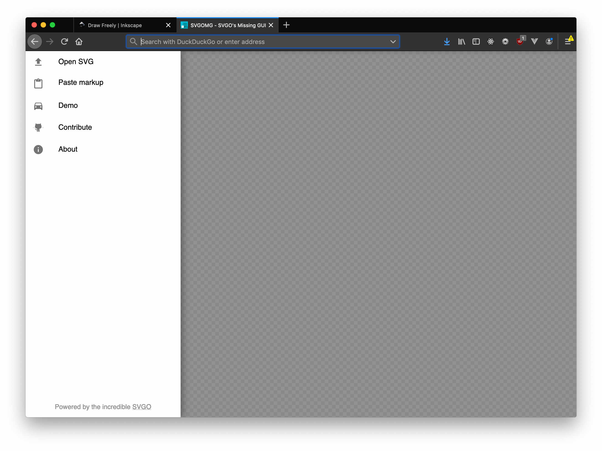
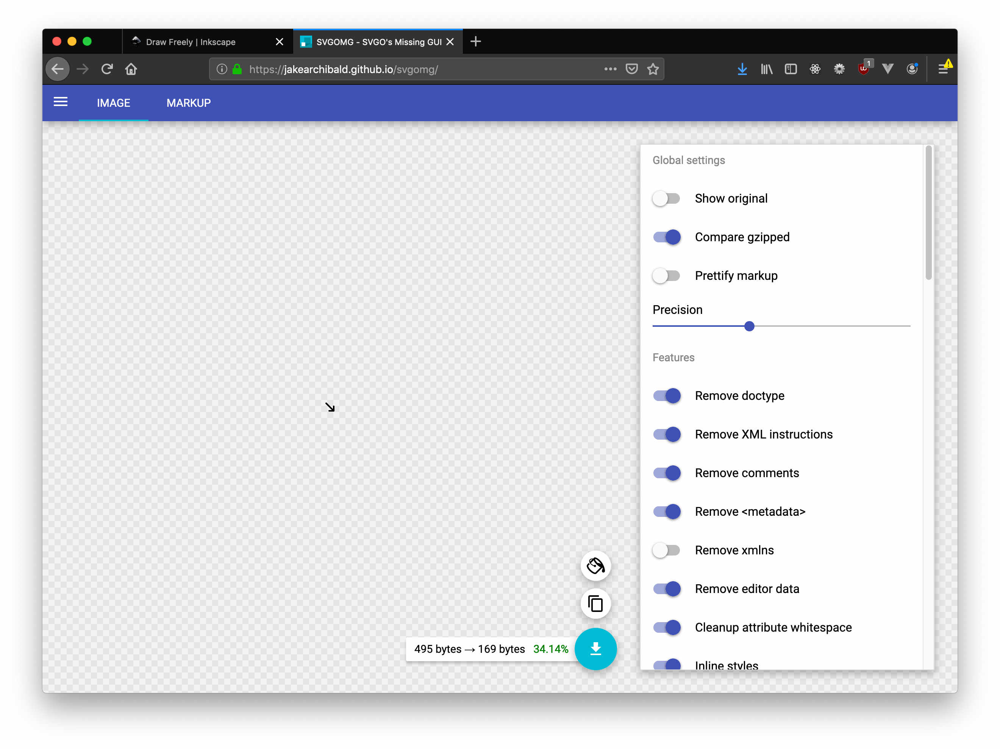

# SVG Optimization

## Creating a SVG

1. Create your **vector** graphic with the tool of your choice. All screenshots here will be used with Adobe Illustrator CS5.

Make sure to resize your artboard to be touching (or close to) the vector.

2. File Save As > Change the file type to SVG

## Optimizing SVG Workflow

1. In the SVG Profile Menu in Save As, click on the "Show SVG Code"

2. Copy the Code that gets generated.

3. Goto [SVGOMG](https://jakearchibald.github.io/svgomg/) and click on Paste Markup, and paste in the copied code. This tool will remove any excess markup from the SVG.

## Illustrator Alternatives

Tired of Adobe?

* [Affinity Tools - Designer, Photo and Publisher](https://affinity.serif.com/en-us/)
* [Inkscape](https://inkscape.org/)

### SVG Icons
* [Ico Moon](http://icomoon.io)
* [Flat Icon](https://www.flaticon.com/)
* [Noun Project](https://thenounproject.com/)

### Optimizing SVGs Tools
* [SVG OMG](https://jakearchibald.github.io/svgomg/)

### SVG 2.0 Spec

*Web users, content authors, and implementers of both browsers and authoring tools all benefit from tight cohesion and interoperability of Web technologies, in terms of functionality and syntax. SVG 2.0 is a backwards-compatible extension and reformulation of SVG 1.1, with key features from SVG Tiny 1.2. SVG 2.0 is intended to work more seamlessly with other Web technologies, such as HTML 5, CSS, DOM, and other core features of the open Web platform. Advanced features of SVG, such as filters, gradients, clipping, and other effects are intended for use with HTML and other presentation languages, as well.*

* [W3C](https://www.w3.org/TR/SVG2/)
* [Editor's Draft of the Spec](https://dev.w3.org/SVG/profiles/2.0/publish/intro.html)
* [Support](https://developer.mozilla.org/en-US/docs/Web/SVG/SVG_2_support_in_Mozilla)
* [SVG Working Group](https://svgwg.org/)
